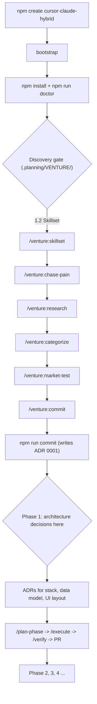

# create-cursor-claude-hybrid

A venture-gated project starter for a Cursor + Claude Code hybrid workflow, where **architecture is a project decision, not a template decision**. The scaffold sets up rails (rules, hooks, security, orchestration) and deliberately defers stack, data model, and file layout to Phase 1 — after the Company-of-One discovery gate has been cleared.

```bash
npm create cursor-claude-hybrid@latest my-project
cd my-project
npm run doctor
```

---

## Prerequisites

Install these **once, globally**, before scaffolding any project:

| Tool | Minimum | Why | Install |
|---|---|---|---|
| Node.js | 18 LTS (20+ recommended) | Bootstrap + all scripts | https://nodejs.org |
| Git | 2.40+ | Worktrees, CI, hooks | https://git-scm.com |
| Cursor | 1.98.0+ | `.cursor/rules/*.mdc` + hooks support | https://cursor.com |
| Claude Code CLI | 2.x | `claude` command in Cursor terminal | See below |
| Anthropic plan | Pro ($20/mo) or Max | Claude Code CLI requires a paid plan (free claude.ai does not work) | https://claude.ai |
| gitleaks | latest (optional but recommended) | Pre-commit secret scan | https://github.com/gitleaks/gitleaks |

### Install Claude Code CLI

```bash
# macOS / Linux / WSL
curl -fsSL https://claude.ai/install.sh | bash

# Windows PowerShell
irm https://claude.ai/install.ps1 | iex
```

### Verify the toolchain before running the bootstrap

```bash
node --version    # must print v18.x or higher
git --version
claude --version  # must print 2.x
cursor --version  # or check Help -> About in Cursor
```

---

## Initial install (new project)

### Fastest path (interactive)

```bash
npm create cursor-claude-hybrid@latest my-project
```

You will be asked four questions. Read the next section before answering — the correct answer for three of them is almost always `deferred`.

### What you are asked, and how to answer

| Prompt | Answer now when... | Answer `deferred` when... |
|---|---|---|
| Target directory | Always — a filesystem path | — |
| Project name | Always — used in docs and `package.json` | — |
| Primary stack | You have a hard, non-negotiable constraint (e.g. inherited team codebase) | You have not yet validated what you are building |
| Database | Same — pre-existing contractual requirement | All other cases |
| Frontend / UI | Same | All other cases |

**Default answer for stack, database, and frontend is `deferred`.** That is the correct and intentional choice. See [Architecture is deferred on purpose](#architecture-is-deferred-on-purpose).

### Non-interactive (skip all prompts, use deferred defaults)

```bash
npm create cursor-claude-hybrid@latest my-project -- \
  --project-name "MyProject" \
  --primary-stack deferred \
  --database deferred \
  --frontend deferred \
  --yes
```

### First-run verification

```bash
cd my-project
npm install       # installs husky + lint-staged only; runtime deps come in Phase 1
npm run doctor    # 18-point health check
```

`npm run doctor` prints a check per line and always ends with a "Next recommended" block:

```
ok  Node >= 18 - node 20.x.x
ok  Claude Code CLI - 2.x.x
ok  Bootstrap complete
!!  Venture gate - open; pending: SKILLSET.md, ...
ok  AGENTS.md
ok  rule 000 / 005 / 035
...
Next recommended
----------------
Surface : Claude Code CLI
Mode    : plan
Model   : Claude Sonnet 4.6
Why     : Venture gate: fill SKILLSET.md next. See .planning/MODE-GUIDE.md.
```

A `WARN` on gitleaks is fine at first. All `FAIL` lines must be resolved before continuing.

### Alternative paths (if you cannot use npx)

**GitHub Template:** create a new repo from this template, clone it, then run the bootstrap script directly:

```powershell
# Windows
.\scripts\bootstrap.ps1 -Destination . -ProjectName "MyProject" -InstallClaudePlugins -Force
```

```bash
# macOS / Linux / WSL
./scripts/bootstrap.sh --project-name "MyProject" --install-claude-plugins --force
```

Both scripts are thin wrappers around `scripts/bootstrap.mjs`.

---

## Architecture is deferred on purpose

The template does **not** scaffold:

- a web framework
- a database driver
- a UI library
- a source directory layout beyond `.planning/`

Those decisions are made inside the project, in Phase 1, **as ADRs under `.planning/adr/`**, driven by what the venture commitment actually needs.

Why:

1. **Validated opportunity first.** What you learn in `.planning/VENTURE/MARKET-TEST.md` often changes the stack (e.g. the winning channel is SMS + landing page, not a SaaS dashboard).
2. **ADR discipline is non-negotiable.** Every architectural choice needs a reversible paper trail. `.planning/adr/0000-template.md` is the template.
3. **Stack placeholders are display labels.** `AGENTS.md` and `PROJECT.md` show `deferred` until an ADR updates them. They do not enforce code shape.

The only structural opt-in at bootstrap time is `--with-feature-skeleton`, which creates a feature-sliced `src/modules/<feature>/` tree. Use it only if you already know Phase 1 will produce a full-stack TS app. Otherwise defer and add it via ADR.

---

## How to prompt correctly with this setup

Every response from Cursor and Claude Code ends with a "Next recommended" block (enforced by `.cursor/rules/035-next-step-hint.mdc`). That block is the handoff. **Always follow it before typing your next message.**

### 1. Follow the `Next recommended` footer — always

```
Next recommended
----------------
Surface : Claude Code CLI
Mode    : plan
Model   : Claude Opus 4.6
Why     : COMMITMENT.md adversarial review needs a model that pushes back hardest.
```

Read it. Switch surface/mode/model as instructed. Do not type the next message into whatever window happens to be open.

### 2. Open every task with context, not with a feature request

Bad:

> "Add a user profile page."

Good (discovery phase):

> Read `.planning/.bootstrap.json` and `.planning/STATE.md`. Then walk me through `.planning/VENTURE/OPPORTUNITIES.md` per rule `006-venture-workflow`. I want to score three pains I witnessed last week.

Good (build phase):

> Read `AGENTS.md`, `.planning/STATE.md`, and `.planning/phase-2/PLAN.md`. Task 2.3 is next. Summarize its acceptance criteria, then propose the smallest diff. Do not write code yet — I want to review the plan first.

The agents always know which gate is active (rules `000`, `005`, `010` are `alwaysApply`). Your job is to point at the specific artifact in `.planning/`.

### 3. Use slash-commands as verbs, prose as nouns

| Slash-command | Use for | Expected output |
|---|---|---|
| `/venture:skillset` | Discovery step 1.2 | Update to `SKILLSET.md` |
| `/venture:chase-pain` | Discovery step 1.3 | Update to `OPPORTUNITIES.md` |
| `/venture:research` | Discovery step 1.4 | Update to `RESEARCH.md` |
| `/venture:categorize` | Discovery step 1.5 | Update to `CATEGORIZATION.md` |
| `/venture:market-test` | Discovery step 1.6 | Update to `MARKET-TEST.md` |
| `/venture:commit` | Discovery step 1.7 | Guides through `COMMITMENT.md` |
| `/plan-phase` | Start a roadmap phase | `.planning/phase-N/PLAN.md` |
| `/execute` | Atomic task execution | Conventional commits + STATE.md |
| `/verify` | Goal-backward phase check | `VERIFICATION.md` |
| `/debug` | Scientific-method bug hunt | Regression test + fix |
| `/ui-review` | Responsive / a11y audit | `UI-REVIEW.md` |
| `/security-audit` | Deps / secrets / hooks / MCP | `SECURITY-AUDIT.md` |
| `/integration-check` | Cross-phase E2E flows | `INTEGRATION-CHECK.md` |
| `/init-memory` | Re-sync `CLAUDE.md` vs `AGENTS.md` | Thin `CLAUDE.md` |

Everything outside this verb set goes as freeform prose to Cursor Agent (short iterations, visual UI) or Claude Code CLI `plan` mode (multi-file, rename, migration).

### 4. Always name the surface you want

Agents do not know which window you are typing in. Lead with:

- "In **Cursor Ask mode**:" — for pure questions, no code changes
- "In **Cursor Plan mode**:" — read-only plan, no edits until approved
- "In **Claude Code CLI, plan mode**:" — multi-file work with diff review in terminal
- "In **Claude Code extension**:" — visual diffs, `@`-mention fuzzy file search

### 5. Respect the mode policy

From `.cursor/rules/030-claude-mode-policy.mdc`:

- Multi-file change or rename → `plan` first.
- Single-line or single-file fix → `default`.
- Scoped refactor after a checkpoint → `acceptEdits`.
- `bypassPermissions` is off-limits outside a sandboxed environment.

If the agent proposes `acceptEdits` without first taking a checkpoint, push back.

### 6. Prompt templates to keep around

**Discovery step (general):**
> Read `.planning/VENTURE/README.md` and the current step file. Coach me through the remaining unfilled sections using rule `006-venture-workflow`. Tag every claim `[FACT]`, `[SIGNAL]`, `[ASSUMPTION]`, or `[OPINION]`. When done, flip the STATUS to DONE and update the Next recommended footer.

**Adversarial commit review:**
> Read `.planning/VENTURE/COMMITMENT.md`. You are a skeptical co-founder. Find the weakest assumption. What breaks if it is false? Rank my kill criteria from softest to hardest. Do not edit the file.

**Phase kickoff:**
> Read `.planning/ROADMAP.md`, `.planning/STATE.md`, `AGENTS.md`. Run `/plan-phase` for the next unstarted phase. If architecture changes, draft the ADR first and let me review it before touching code.

**Bug investigation:**
> In Cursor Agent mode. Here is the stack trace: `<paste>`. Follow the `/debug` protocol: observation, hypothesis, minimal repro, instrumentation, experiment, fix, regression test. Do not write a fix until you have a minimal repro.

**Architecture decision:**
> I need to decide between X and Y for `<concern>`. Read `.planning/PROJECT.md` and relevant ADRs. Produce a draft ADR using `.planning/adr/0000-template.md`: context, decision, consequences, reversal cost. Do not implement — I want to review the ADR first.

### 7. Anti-patterns

- **Prompting both agents on the same files in parallel.** Rule `040-task-ownership` exists because their contexts diverge silently.
- **"Just do it, I trust you."** Fine for a typo fix. For anything multi-file, always ask for `plan` mode output first.
- **Skipping `/verify`.** A phase is not done until the verifier says PASS.
- **Pasting whole files into chat.** Use `@`-mention fuzzy match (Claude Code extension) or explicit relative paths.
- **Treating "Next recommended" as optional.** It is the handoff protocol — skipping it is how you end up on the wrong surface.

---

## Integration into an existing project

### Path A — Opinionated layering (recommended)

For a repo that has code but no agent rails.

1. **Create a branch.**
   ```bash
   git checkout -b chore/add-cursor-claude-hybrid
   ```

2. **Scaffold into a sibling folder.**
   ```bash
   npm create cursor-claude-hybrid@latest ../hybrid-overlay -- \
     --project-name "YourProject" \
     --primary-stack deferred --database deferred --frontend deferred --yes
   ```

3. **Copy the minimum file set into your repo** (do not overwrite files you already have — merge instead):
   ```
   AGENTS.md
   CLAUDE.md
   CLAUDE.local.md.example
   .cursor/rules/          (copy the whole folder)
   .cursor/hooks.json
   .claude/settings.json
   .claude/commands/
   .mcp.json
   .planning/
   .husky/pre-commit
   scripts/complete-bootstrap.mjs
   scripts/venture-commit.mjs
   scripts/doctor.mjs
   scripts/worktree.mjs
   tsconfig.base.json      (only if repo uses TypeScript)
   .github/PULL_REQUEST_TEMPLATE.md
   .github/workflows/ci.yml   (merge into existing CI, do not overwrite)
   .editorconfig              (only if you do not already have one)
   .gitignore                 (merge, do not overwrite)
   ```

4. **Merge `package.json` scripts and devDependencies:**
   ```json
   "scripts": {
     "bootstrap": "node ./scripts/complete-bootstrap.mjs",
     "commit":    "node ./scripts/venture-commit.mjs",
     "doctor":    "node ./scripts/doctor.mjs",
     "worktree":  "node ./scripts/worktree.mjs"
   },
   "devDependencies": {
     "husky": "^9.x",
     "lint-staged": "^15.x"
   }
   ```

5. **Run `npm install` then `npm run bootstrap`** to flip the bootstrap marker.

6. **Decide: do you need the discovery gate?**

   - *Existing validated product* → manually set `"venture.committed": true` in `.planning/.bootstrap.json` and write `.planning/adr/0001-venture-skipped.md` explaining why (e.g. "ongoing SaaS, validated, template retrofitted 2026-Q2"). Set `currentPhase` to your current phase.
   - *Product that could still pivot* → keep the gate; fill VENTURE files with what you already know; run `npm run commit` to formalize.

7. **Backfill `.planning/STATE.md`** with current phase and focus.

8. **Run `npm run doctor`** — it will surface anything missing.

9. **Open a PR.** Use the new `PULL_REQUEST_TEMPLATE.md`.

### Path B — Minimal overlay (rails only, no venture gate)

For internal tools, client projects, or utilities where the venture framework does not apply.

1. Copy only:
   ```
   AGENTS.md
   CLAUDE.md
   .cursor/rules/000-bootstrap-guard.mdc
   .cursor/rules/010-planning-sync.mdc
   .cursor/rules/020-security.mdc
   .cursor/rules/030-claude-mode-policy.mdc
   .cursor/rules/035-next-step-hint.mdc
   .cursor/rules/040-task-ownership.mdc
   .cursor/rules/100-frontend.mdc
   .cursor/rules/110-backend.mdc
   .cursor/rules/200-testing.mdc
   .cursor/hooks.json
   .claude/settings.json
   .claude/commands/{plan-phase,execute,verify,debug,ui-review,security-audit,integration-check,init-memory}.md
   .planning/{STATE.md,MODE-GUIDE.md,adr/0000-template.md,config.json}
   scripts/doctor.mjs
   .husky/pre-commit
   .mcp.json
   ```

2. Skip: `005-venture-gate.mdc`, `006-venture-workflow.mdc`, `.planning/VENTURE/`, `.claude/commands/venture/`, `scripts/venture-commit.mjs`.

3. Create `.planning/.bootstrap.json` with:
   ```json
   { "bootstrapped": true, "venture": { "committed": true } }
   ```
   so rules `000` and `005` pass immediately.

4. Commit.

### Path C — Single-file trial (lowest friction)

If you only want the `Next recommended` footer behavior before deciding:

1. Copy `template/AGENTS.md`, `template/.cursor/rules/035-next-step-hint.mdc`, and `template/.planning/MODE-GUIDE.md`.
2. Ask your agents to follow rule 035.

---

## Flow end-to-end



---

## After the gate opens

```bash
# in Claude Code CLI, plan mode
/plan-phase

# review .planning/phase-1/PLAN.md and approve

# Claude Code CLI, default mode
/execute

# Claude Code CLI, default mode
/verify

# open PR — fill .github/PULL_REQUEST_TEMPLATE.md
```

Every step's footer tells you the next surface, mode, and model.

---

## What gets generated

```
my-project/
  AGENTS.md                     # source of truth for both agents
  CLAUDE.md                     # Claude Code entry (points at AGENTS.md)
  CLAUDE.local.md.example       # copy to CLAUDE.local.md for personal overrides
  .cursorrules                  # thin Cursor pointer (see .cursor/rules/ instead)
  .cursor/
    rules/
      000-bootstrap-guard.mdc   # self-enforcement (alwaysApply)
      005-venture-gate.mdc      # Company-of-One gate (alwaysApply)
      006-venture-workflow.mdc  # discovery coach (globs: .planning/VENTURE/**)
      010-planning-sync.mdc     # STATE.md discipline (alwaysApply)
      020-security.mdc          # security floor (alwaysApply)
      030-claude-mode-policy.mdc
      035-next-step-hint.mdc    # mandatory Next recommended footer (alwaysApply)
      040-task-ownership.mdc    # single-writer rule (alwaysApply)
      100-frontend.mdc          # globs-scoped to *.tsx, *.css
      110-backend.mdc           # globs-scoped to server/**, api/**
      200-testing.mdc           # globs-scoped to *.test.*, *.spec.*
    hooks.json                  # deny/ask for shell commands + file reads
  .claude/
    settings.json               # permissions (deny/ask/allow) + plan default mode
    commands/
      init-memory.md
      plan-phase.md / execute.md / verify.md / debug.md
      ui-review.md / security-audit.md / integration-check.md
      venture/{skillset,chase-pain,research,categorize,market-test,commit}.md
    skills/README.md
  .mcp.json                     # whitelist: filesystem MCP only
  .planning/
    .bootstrap.json             # bootstrapped + venture.committed flags
    PROJECT.md / ROADMAP.md / STATE.md / BACKLOG.md
    config.json                 # branching_strategy: phase
    MODE-GUIDE.md               # surface/mode/model lookup table
    VENTURE/                    # 7-step Company-of-One workflow
    adr/0000-template.md
  scripts/
    complete-bootstrap.mjs      # flip marker when cloning manually
    venture-commit.mjs          # validate VENTURE files + flip gate
    doctor.mjs                  # 18-point health check
    worktree.mjs                # parallel experiment helper
  .github/
    workflows/ci.yml            # gitleaks + typecheck + test
    PULL_REQUEST_TEMPLATE.md
  .husky/pre-commit             # gitleaks + lint-staged + bootstrap check
  .gitignore / .editorconfig / .env.example / LICENSE
  package.json                  # bootstrap, commit, doctor, worktree scripts
  tsconfig.base.json            # strict TS defaults (optional base import)
```

---

## Troubleshooting

- **`claude: command not found`** — install Claude Code CLI per the Prerequisites table. `npm run doctor` will go green once it is on PATH.
- **Cursor extension missing after Cursor update** — known issue (per DataCamp guide). Fallback: run `claude` in Cursor's integrated terminal; all slash-commands still work there.
- **`npm run commit` refuses even though files look done** — it scans for `<!-- fill ... -->` placeholders and `STATUS: TODO`. Flip the STATUS marker and remove every placeholder token.
- **`venture.committed` was set too early** — revert by editing `.planning/.bootstrap.json` only if a new ADR supersedes ADR 0001. Otherwise enforce the kill criteria instead.
- **Rules feel ignored** — `.cursor/rules/*.mdc` only load if Cursor >= 1.98.0. Check `Help -> About`. If the version is older, update Cursor first.
- **`npm run doctor` shows `!! Stack fields still 'deferred'`** — you are in the build phase and have not yet created ADRs for stack, database, or frontend. Create the ADRs under `.planning/adr/` and update `.planning/.bootstrap.json` accordingly.

---

## Keeping both agents in sync

Cursor reads `.cursor/rules/*.mdc`. Claude Code reads `CLAUDE.md`. Neither can see the other. Both point at `AGENTS.md` so changes happen once. `npm run doctor` warns if they drift.

---

## References

- Claude Code in Cursor — DataCamp guide: https://www.datacamp.com/de/tutorial/claude-code-in-cursor
- Cursor Rules docs: https://docs.cursor.com/context/rules
- Claude Code CLI docs: https://code.claude.com/docs
- Company of One framework — Troy's DOCX (personal reference, not included)
